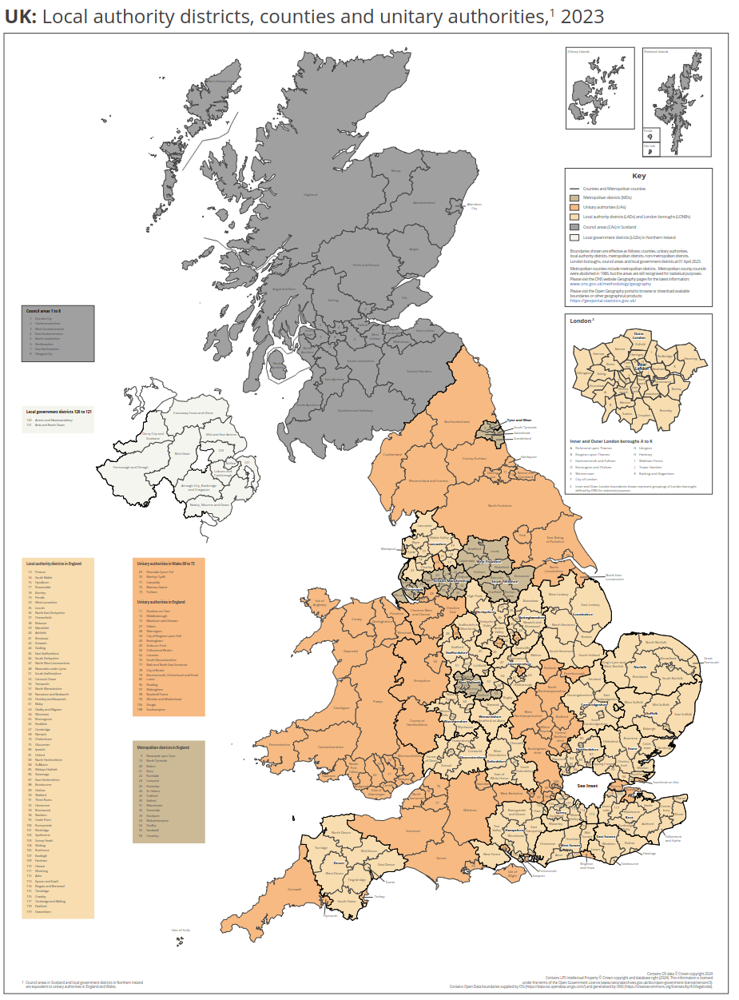
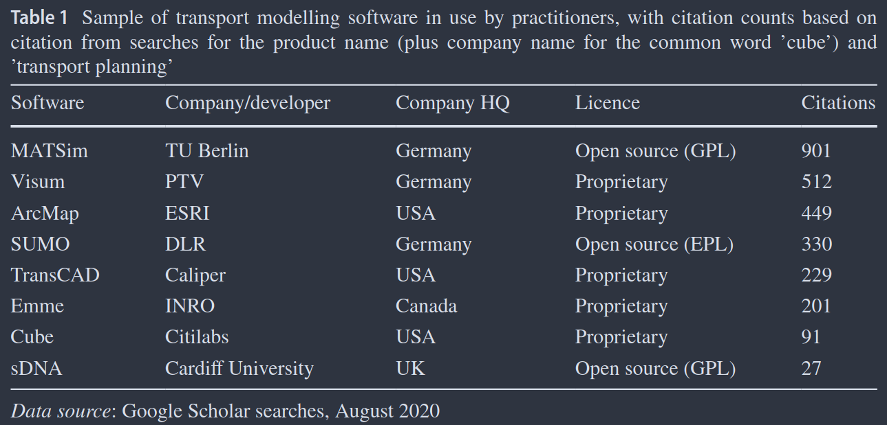
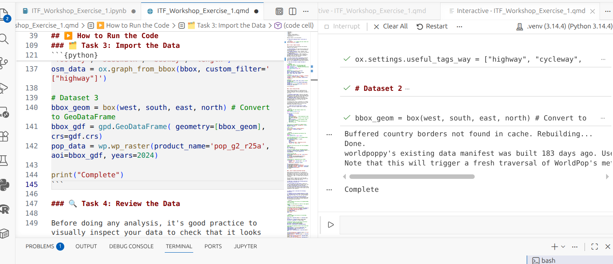
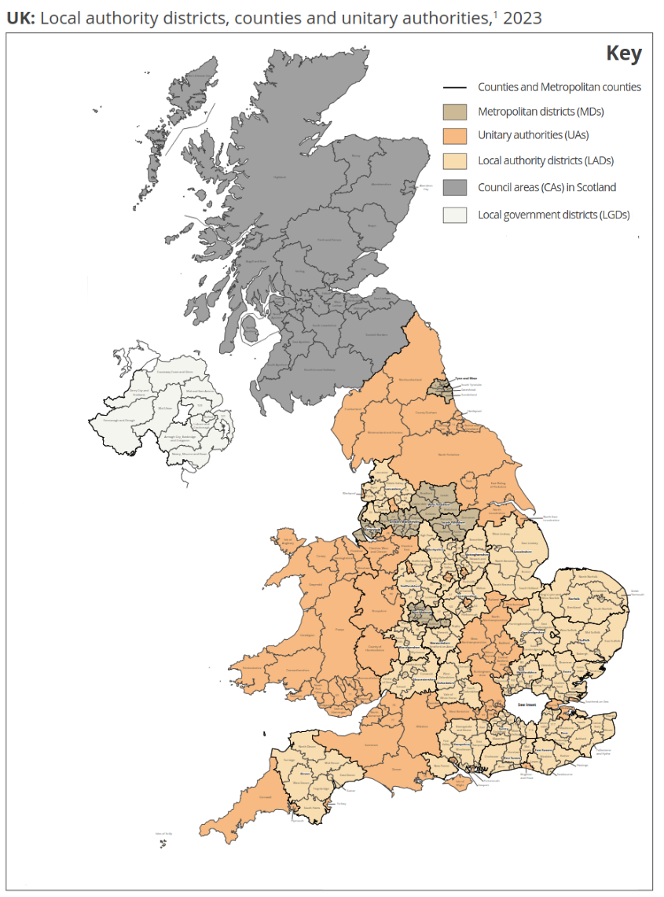

## Introduction

-   **Who am I?** Professor of Transport Data Science at the University of Leeds, with 2 years experience working in the UK Civil Service (Head of Data and Digital, Active Travel England, part of the Department for Transport).
-   **My focus:** Building open, reproducible, and policy-relevant transport planning tools.
-   **Today's topic:** Building a *community of practice* for data-driven transport decision-making in Ukraine.
-   **Why it matters:** Supporting evidence-based transport planning, recovery and EU integration.

::: notes
Thank you for the invitation to speak at this important conference.
My work is all about bridging the gap between data science and transport policy — I believe that by building capacity through open and transparent methods, we can make better decisions about how our cities move.

This is especially relevant for Ukraine, which is at a critical juncture in developing its transport systems.
The principles I'll discuss today can help build a strong foundation for evidence-based policymaking.
:::

## The challenge: the data-to-policy gap

We have more data than ever before, but are we using it effectively?

**Common Barriers:**

-   **Data Access:** Data is often siloed, proprietary, or not in a usable format.
-   **Skills & Tools:** Lack of training and accessible tools to analyse the data.
-   **Institutional Culture:** Resistance to new methods and a disconnect between analysts and decision-makers.
-   **Procurement:** Over-reliance on 'black box' commercial solutions.

::: notes
This is a challenge we see everywhere.
We are drowning in data but starving for wisdom.
The key barriers are often not technical, but institutional and cultural.
How do we get the right data, to the right people, with the right tools, in a way that is trusted by policymakers?
The complexity causes duplication of effort and the potential for vacuums of responsibility.
If there were good communications between each layer of government it would be less of an issue.
Transport decisions must be made at the local level, and there is a need for national government, so layers are needed.
It is worth thinking about how to make them more efficient.
:::

------------------------------------------------------------------------

::::: columns
::: {.column width="50%"}
**Geoadministrative friction**

In the UK, for example, transport decisions made at 4 main levels:

1.  UK Parliament (UK-wide)

2.  Devolved departments, e.g.
    DfT (national)

3.  Combined Authorities (e.g. West Yorkshire)

4.  Local Authorities (e.g. Leeds City Council).

Source: [statistics.gov.uk](https://geoportal.statistics.gov.uk/documents/ons::local-authority-districts-counties-and-unitary-authorities-april-2023-map-in-the-uk/)
:::

::: {.column width="50%"}
<!--  -->


:::
:::::

::: notes
In the UK, transport governance is split across multiple layers: national, devolved, regional, and local.
This creates what I call "geoadministrative friction".
Decisions and data don't always flow smoothly between levels.

Not necessarily bad to have multiple layers: transport decisions are often more effective when made locally.
But there are overlapping and inconsistent layers, and the systems create tensions and inefficiencies.

Ukraine, as it develops its transport institutions, has an opportunity to design more efficient structures and clear lines of responsibility from the outset.
Thinking carefully about which level of government is best placed to make which decisions — and ensuring data and tools are available at each level — is a key part of building sustainable transport capacity.
:::

------------------------------------------------------------------------

## Problem: stop-start funding for transport

Source: [github.com/itsleeds/uktransportauthorities](https://github.com/itsleeds/uktransportauthorities)

{width="100%" style="display:block;margin:0;padding:0;"}

## Problem: proprietary 'black box' tools



Source: @lovelace2021, source code: [github.com/robinlovelace](https://github.com/Robinlovelace/open-gat)

## Problem: 'just build on top of it' (dependency)

::::: columns
::: {.column width="50%"}
Most modelling systems are built on layers of legacy tools, data, and code that nobody fully understands.

The temptation is always to add another layer rather than fix the foundations.

Source: "Dependency" by Randall Munroe: [xkcd.com/2347/](https://xkcd.com/2347/)
:::

::: {.column width="50%"}

:::
:::::

::: notes
This xkcd comic captures a fundamental truth about software — and by extension, transport modelling.
Most projects are built on top of previous work that may be poorly documented, poorly understood, or fragile.

The temptation is always to just add another layer rather than fix the foundations.
But building 'on top' of technical debt without addressing it leads to increasingly unstable systems.
An open, reproducible approach lets us acknowledge and manage this complexity rather than pretending it doesn't exist.
:::

## A solution: open & reproducible workflows

Openness builds trust and empowers collaboration.

-   **Open Source:** The code is free to use, modify, and share.
-   **Open Data:** Public data is accessible to everyone.
-   **Open Methods:** Methodologies are transparent and documented.
-   **Open Access:** Research and educational materials are freely available.
-   **Community of Practice:** People learning from each other.

::: notes
An open approach is the foundation for building sustainable capacity.
When methods are open, they can be scrutinized, validated, and improved by the community.
When educational resources are open access, they lower the barrier for people to learn these vital skills.
:::

## Solution 1: open data & standards

Good analysis starts with good data.

-   **Data Standards are Key:**
    -   GTFS for public transport schedules.
    -   GBFS for shared micro-mobility (bikes, scooters).
    -   OpenStreetMap for detailed street network data.
-   **National Data Portals:** A vital resource for official statistics.
-   **Example:** Sourcing road network data from OpenStreetMap for transport analysis across an entire country.

::: notes
The first step in building analytics capacity is to get a handle on the data itself.
Adopting international standards like GTFS is crucial — it makes data interoperable and allows you to use a wide range of open-source tools.
OpenStreetMap is a powerful, free resource for transport network data.
:::

## Solution 2: open source tools and materials

Powerful, free, and adaptable tools for transport analysis.

-   **Python and R Ecosystems:** Mature libraries for data science, statistics, and visualisation.
    -  Free teaching materials including Geocomputation with R's Transport chapter [@lovelaceGeocomputation2025], Geocomputation with Python [@dormanGeocomputationPython2025] and Applied Geostatistics with Python [@pyrczAppliedGeostatisticsPython2024].  
    - There is so much content out there, updated every month, it's worth searching online for the latest resources, and getting in touch with authors.
-   **Python libraries:** `osmnx` for OpenStreetMap, `geopandas` for spatial data, `grid2demand` for demand modelling, `madina` for urban network analysis [@sevtsukMadinaPythonPackage2025a].
-   **These tools can be adapted** to local needs and data sources, and extended

## Solution 3: communities of practice

Capacity building is not just about tools, it's about people.

-   A Community of Practice is a group who "share a concern for something they do and learn how to do it better as they interact regularly."
-   Open source projects naturally foster these communities.
-   Examples: rOpenSci, QGIS user groups, transport modelling forums.
-   To build capacity, invest in building communities, they don't just happen, they must be built.

**Personal connections are more important than platforms.**

::: notes
The image shows an analysis of travel patterns done entirely with open-source tools and open data.
This kind of analysis is reproducible and can be adapted to any city where you have the necessary data.
:::

## Solution 4: openly available results

[Results](https://github.com/Robinlovelace/itfworkshop/blob/main/create_flowmap.R) that are open access can be seen 'de-silo' transport planning.
<!-- Skill: web development (or at least collaboration with web developers/AI tools to build web interfaces). -->

<iframe src="files/basic_flowmap.html" width="100%" height="500px" style="border: none;">

</iframe>

::: notes
This video demonstrates the kind of interactive, reproducible analysis that open tools enable.
The data comes from Spain's national mobility survey, accessed through the community-maintained `spanishoddata` package.
:::


## Solution 5: open and reproducible environments

<!-- https://robinlovelace.net/itfworkshop/images/paste-1.png -->



Flexible and open reproducible development environment using devcontainers and GitHub codespaces (Google Colab alternative).

Source: [robinlovelace.net/itfworkshop](https://robinlovelace.net/itfworkshop/images/paste-1.png)

<!-- 

Source: [GeoLibre's 'devbox' free code environment](https://codesandbox.io/p/github/opengeos/geolibre), enabling a full GIS in the browser -->

```{=html}
<!-- ## Case study: national-scale planning (UK)

From local data to national strategy.

-   **Purpose:** Prioritise investment in walking and cycling infrastructure.
-   **How it works:**
    -   Integrates dozens of open datasets (census, road safety, network data).
    -   Uses a transparent, open-source model.
    -   Provides a web interface for planners across the country.
-   **Impact:** A consistent, evidence-based approach to national transport planning.

::: notes
This is a real-world example of building capacity at a national level.
Because the methodology is open, local authorities can understand, trust, and challenge the recommendations.
This demonstrates how a national body can empower local and regional planners.
::: -->
```


## Case study: open OD data in Spain

-   The `spanishoddata` R package provides access to open origin-destination data [@kotov2026]
-   It is a community-driven project, adopted by **rOpenSpain**, ensuring long-term maintenance.
-   Used by researchers and public bodies, including the **Spanish Ministry of Transport**.
-   A successful model of collaboration between government, academia, and the open-source community.

::: notes
The government releases the data and the community builds the tools to make it accessible.
This creates a virtuous cycle — better tools lead to more use, which justifies continued data release.
:::

## Making it happen in Ukraine

**Caveat:** No one-size-fits-all solution, may be possible to leapfrog some challenges!

How can these principles be applied?

1.  **Data Audits:** What data exists? What format is it in? What can be opened?
2.  **Pilot Project:** Choose a specific problem/region to test solutions **that can scale nationally**.
3.  **Invest in Training and collaboration:** Build future-proof skills, including efficient use of AI.

::: notes
The journey starts with a single step.
A pilot project is a fantastic way to demonstrate value and build momentum.
Events like this are a perfect opportunity to build networks that will support a community of practice.
:::

## What we can learn from Ukraine {background-image="images/paste-4.png" background-opacity="0.3"}

- **Rapid adoption of new technologies.**
- **Dealing with network disruptions.**
- **Building resilience in the face of external shocks.**
- **Specifically: dealing with infrastructure damage, variable fuel supply, and rapidly changing demand patterns.**

**These are all things many countries are likely to need**

**Source: [wartranslated](https://x.com/wartranslated/status/2065376241402724815?s=20)**

## Links and future directions {background-image="images/paste-3.png" background-opacity="0.5"}

-   Sustainable capacity is built on **open data, open tools, and an open community.**
-   [bridgeukraine.org](https://bridgeukraine.org) an initiative to build capacity
-   Slides and code: `github.com/robinlovelace/itfworkshop`
-   Related materials: `tdscience.github.io/tartu26/`
-   Contact: `r.lovelace@leeds.ac.uk`

::: notes
Future directions: new data & new challenges

The landscape is always changing.

-   **Emerging Data Sources:** Mobile phone data, GPS tracks, sensor data.
-   **New Challenges:**
    -   **Quality & Bias:** Are these new datasets representative?
    -   **Privacy & Ethics:** How do we use sensitive data responsibly?
    -   **Governance:** Who owns the data and the insights?

We must be 'critical data scientists' and ask hard questions about bias, privacy, and ethics.
Who is left out of these new datasets?
How can we ensure that data-driven decisions are equitable?
This is a key area where statistical offices have a vital role to play.
:::

## References {scrollable="true"}

::: {#refs}
:::

## Example: refugee displacement flows from Ukraine (video)

An interactive flow map showing refugee displacement from Ukraine to host countries (2022–2025 data).

<video width="100%" controls>

<source src="files/ukraine_flowmap.mp4" type="video/mp4">

Your browser does not support the video tag.
</video>

::: notes
This video screencast visualises Ukrainian refugee displacement data from UNHCR, rendered using the `mapgl` R package with a MapLibre WebGL backend.
Each flow line connects Ukraine to a host country, with line thickness proportional to the number of displaced people recorded.
:::